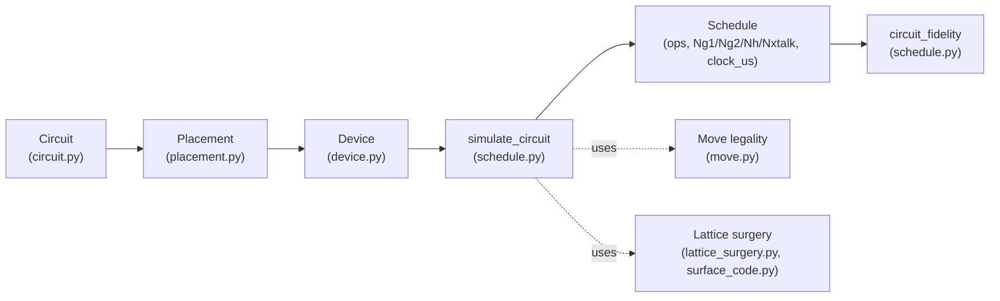

# Overview & Pipeline

NASim turns a logical circuit into a  schedule in five
stages.

## The stages

**1. Circuit (`circuit.py`)**
A circuit is a tuple of *stages*, where every gate in a stage is meant to
execute concurrently, and every stage is pure (all 1-qubit or all 2-qubit
gates. You can build a `Circuit` in two ways: `Circuit.from_stages(...)` when
you want to specify the stage boundaries yourself, or
`Circuit.from_gates(...)` when you only have a flat, dependency-ordered gate
list and want the stage boundaries computed for you via **ASAP-separate
scheduling**. See [Scheduling](scheduling.md).

**2. Initial Placement (`placement.py`)**
Assigns every logical qubit a physical anchor position on the device before
simulation starts. Two algorithms are available: `piqasso_placement`
(force-directed, works on any device) and `zap_placement` (deterministic,
routing-aware, requires a zoned device). See [Placement](placement.md).

**3. Device (`device.py`)**
A device is a set of trap-site grids (`SLM`s). A *uniform* device is one
grid; a *zoned* device has a `storage` grid and an `entanglement` grid kept
spatially separate. See
[Zoned Architecture](zoned-architecture.md).

**4. `simulate_circuit` (`schedule.py`)**
Walks the circuit stage by stage; for a 1-qubit stage it
records one shared pulse, for a 2-qubit stage it decides idle-qubit
stay/return ([Idle-Qubit Management](idle-management.md)), routes patches
into the entanglement zone, legalises the resulting moves into AOD-safe
frames ([Movement & Routing](movement.md)), and executes each 2-qubit gate as
a lattice-surgery merge/split ([Lattice Surgery](lattice-surgery.md)). It
returns a `Schedule` (the full operation trace plus summary counters) and the
final `Placement`.

**5. Fidelity (`schedule.py::circuit_fidelity`)**
Post-processes a finished `Schedule` into a single fidelity estimate (under
development).

## Supporting modules

| Module | Role |
|---|---|
| `geometry.py` | `Position` - the shared 3D coordinate type |
| `model.py` | Physical parameters (gate durations, fidelities, $T_2$, movement speed) loaded from YAML presets |
| `surface_code.py` | `Patch` - a rotated surface-code patch's atom layout |
| `lattice_surgery.py` | Merge/split geometry for two adjacent patches |
| `move.py` | `Move`, AOD conflict/compatibility rules, frame legalisation |
| `legality.py` | Standalone geometric/legality checks |
| `viz/` | Matplotlib-based device, placement and schedule visualization |
