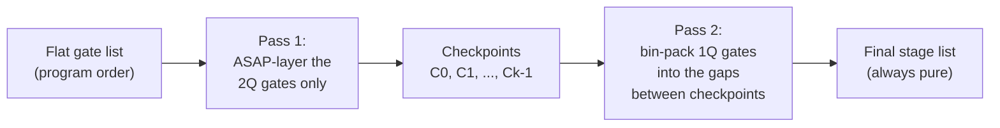

# Scheduling: ASAP-Separate

Based on ZAP (Huang et al., IEEE TQE 2026), Section V-A / Fig. 2-3.

## The problem

A `Circuit` is a tuple of *stages*, and every stage must be pure, because a 1-qubit gate
doesn't need the entanglement zone and a 2-qubit gate does. Given only a
flat, dependency-ordered gate list (no pre-chosen stage boundaries), how do
you decide the boundaries?

## ASAP-separate

**Schedule all 2-qubit gates first, in isolation, then fill the gaps with
1-qubit gates.**

**Pass 1 - the 2Q skeleton.** Walk only the 2-qubit gates in program order.
Each gate on `(qa, qb)` is assigned checkpoint
`max(cursor[qa], cursor[qb]) + 1`, where `cursor[q]` is the last checkpoint
qubit `q` has used so far; gates with disjoint qubit sets naturally land in
the same checkpoint. This is standard list-scheduling ASAP, restricted to
2-qubit gates only.

**Pass 2 - bin-pack the 1-qubit gates.** Each qubit's own 2-qubit
participation splits its 1-qubit gates (still in program order) into `k+1`
buckets: before checkpoint 0, between checkpoint 0 and 1, ..., after the
last checkpoint. A qubit with no 2-qubit gate at all puts everything in the
first bucket. Within one bucket, `depth = max over qubits`
determines how many 1-qubit-only stages the gap needs; same-qubit gates
serialize into successive sub-stages, different qubits' gates pack freely
into the same one.