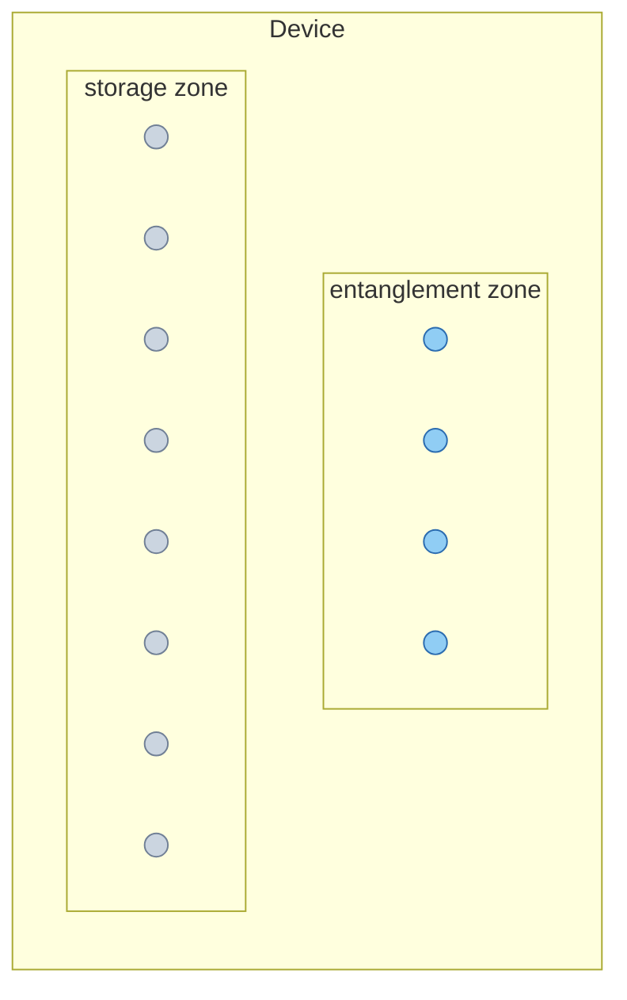

# Zoned Architecture

Based on ZAP (Huang et al., *"Zoned Architecture and Performant Compiler for
Field-Programmable Atom Array"*, IEEE Trans. Quantum Eng. 2026).

## Why zones

Two-qubit gates on neutral atoms need a global Rydberg excitation field,
which illuminates *every* nearby atom. Spatially separating "storage" (where idle qubits
sit) from "entanglement" (where 2-qubit gates actually happen) confines that
exposure to a small region instead of the whole device.

## Device model (`device.py`)

A `Device` is built from one or more `SLM` trap-site grids. `Device.uniform`
makes a single unzoned grid; `Device.zoned` builds two grids, `storage` and
`entanglement`, separated by a configurable gap.

## Crosstalk accounting (`schedule.py`)

When a merge happens, every *other* patch currently resident in the
entanglement zone is a crosstalk bystander (`_entanglement_zone_bystanders`).
Each syndrome-extraction CZ sub-step during that merge increments
`schedule.Nxtalk` by the bystander atom count. This feeds directly into
`circuit_fidelity` as a `carrier_fidelity ** Nxtalk` term.

Because 2-qubit gates can *only* happen with both patches in the
entanglement zone, every merge requires routing at least one patch there
first, which is why [Placement](placement.md) (minimizing expected routing
distance) and [Idle-Qubit Management](idle-management.md) (deciding whether
a patch is worth moving back out again) are both zone-aware.
